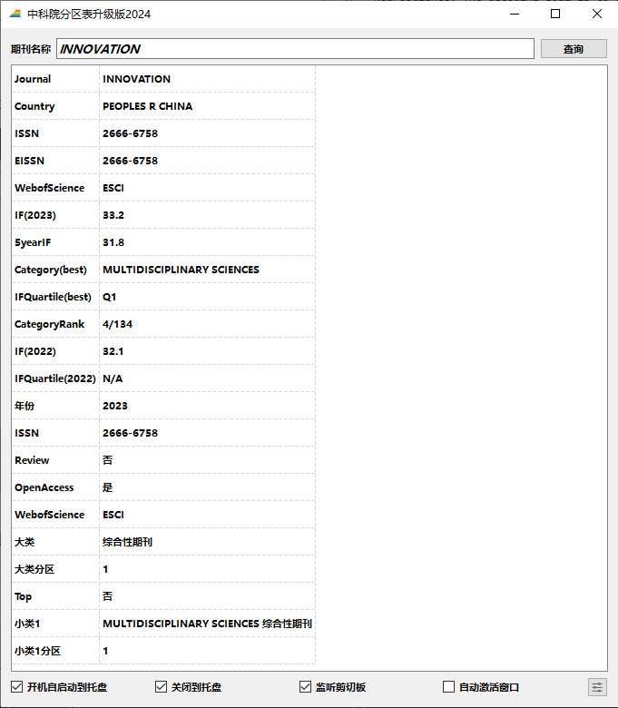

# ShowJCR

## 前言

科研成果经常以发表不同层次的国际学术期刊为体现，因此评价国际学术期刊影响力至关重要。中国科研人员常用的期刊评价标准包括JCR（[Journal Citation Reports](https://jcr.clarivate.com/)）和中科院分区表（[中国科学院文献情报中心期刊分区表](http://www.fenqubiao.com/)）等。中科院分区表在2019年试行升级版，并在2019-2021的3年过渡期同时发布基础版和升级版，便于用户单位过渡、调整。自2022年开始，将只发布升级版。因此，中科院分区表升级版已经成为科研人员选择学术期刊的重要依据。

中科院分区表升级版设计了“期刊超越指数”取代JCR中的期刊影响因子（Impact Factor）指标，没有提供期刊的影响因子作为参考。

此外，中科院分区表于2020年12月31日发布[《国际期刊预警名单（试行）》](https://mp.weixin.qq.com/s/xbyJFtR2lezv6CyRrkxsdA)，该名单没有体现在升级版中。

针对上述需求，为了科研人员更方便直观的获取国际学术期刊影响力评价，因此在2020年中科院分区表升级版的基础之上，补充展示了期刊影响因子和国际期刊预警等级。

## 数据来源

中科院分区表升级版数据来源于[advanced.fenqubiao.com](http://advanced.fenqubiao.com)，信息包括期刊是否为Review、是否为Open Access、Web of Science收录类型（分为SCI、SCIE、SSCI、ESCI等）、是否为Top期刊、大类分区信息、（一至多个）小类分区信息，最新为2023年版（2023年12月27日发布），并保留2022年版、2021年版作为对比。

JCR期刊影响因子和最佳分区更新到2023版（2024年6月20日发布），并保留2022年影响因子和最佳分区、2021年影响因子和2020年的影响因子。

国际期刊预警等级来源于[《国际预警期刊名单》（2020、2021、2023、2024年）](https://ewl.fenqubiao.com/#/README)，2024年版不再区分预警等级而改为预警原因。

中国计算机学会（CCF）[推荐国际学术会议和期刊目录（2022年）](https://www.ccf.org.cn/Academic_Evaluation/By_category/)，[计算领域高质量科技期刊分级目录（2022年）](https://www.ccf.org.cn/ccftjgjxskwml/)。

### SQLite3数据库生成步骤

国际期刊信息的原始数据随附在源代码中。

使用[DB Browser for SQLite](https://sqlitebrowser.org/)创建jcr.db，csv格式原始数据的导入顺序（jcr.db中的表名）为JCR2023、JCR2022、JCR2021、JCR2020、GJQKYJMD2024、GJQKYJMD2023、GJQKYJMD2021、GJQKYJMD2020、CCF2022、CCFT2022、FQBJCR2023、FQBJCR2022、FQBJCR2021。

### 导入新的分区信息

导入新的分区信息，只需要在jcr.db增加相应的数据表，无需修改程序源代码。

分区信息可以处理为csv格式，作为新的数据表使用[DB Browser for SQLite](https://sqlitebrowser.org/)导入到jcr.db（包含在源代码和可执行版本ShowJCR.7z中）。

新的分区信息表的字段格式可以是两种形式：

1. 表第一个数据字段为“Journal”，例如

   | Journal                  | IF(2021) |
   | ------------------------ | -------- |
   | PROCEEDINGS OF THE  IEEE | 14.91    |
   | ······                   | ······   |

2. 表第一个数据字段为其他检索关键字（比如“期刊简称”、“中文刊名”等），第二个数据字段为为“Journal”，例如

   | 刊物简称   | Journal                 | 领域           | CCF推荐类型 |
   | ---------- | ----------------------- | -------------- | ----------- |
   | Proc. IEEE | Proceedings of the IEEE | 交叉/综合/新兴 | A类         |
   | ······     | ······                  | ······         | ······      |

数据表的设计核心是必须包含“Journal”字段，该字段是程序默认的搜索字段；如果“Journal”不是数据表的第一个字段，则该字段之前的字段也将被增加为搜索字段，其字段数据也可以在程序中查询。

## Release发布版

### 运行依赖

1. **jcr.db**，期刊信息数据库；
2. Qt相关依赖（使用windeployqt获取所有依赖项并删除国际化translations文件夹）。

### 可执行版本

提供两种可执行版本：

1. ShowJCR.7z，解压到任意目录下执行ShowJCR.exe；
2. ShowJCR.exe，使用[Enigma Virtual Box ](http://www.enigmaprotector.com/)对所有依赖执行封包，单一程序即可独立执行。

## 使用说明

软件的使用十分方便，如图所示，输入期刊名称，点击“查询”或输入“回车”即可获得期刊详细信息。

期刊名称输入时具备联想功能，并且不区分大小写。

如上图中红框所示，软件还具有4个属性选项：

1. 开机自启动到托盘；
2. 退出到托盘；
3. 监听剪切板：在后台监听剪切板，如果复制文字为期刊名称，将自动进行查询；
4. 自动激活窗口：与监听剪切板配合使用，当监听到期刊名称并自动查询完成后，将窗口显示到桌面最前。

