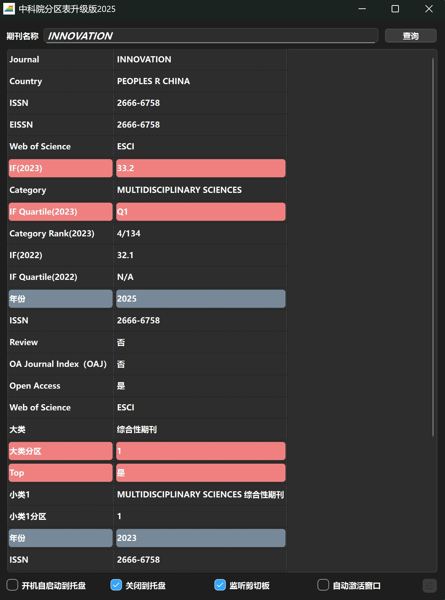
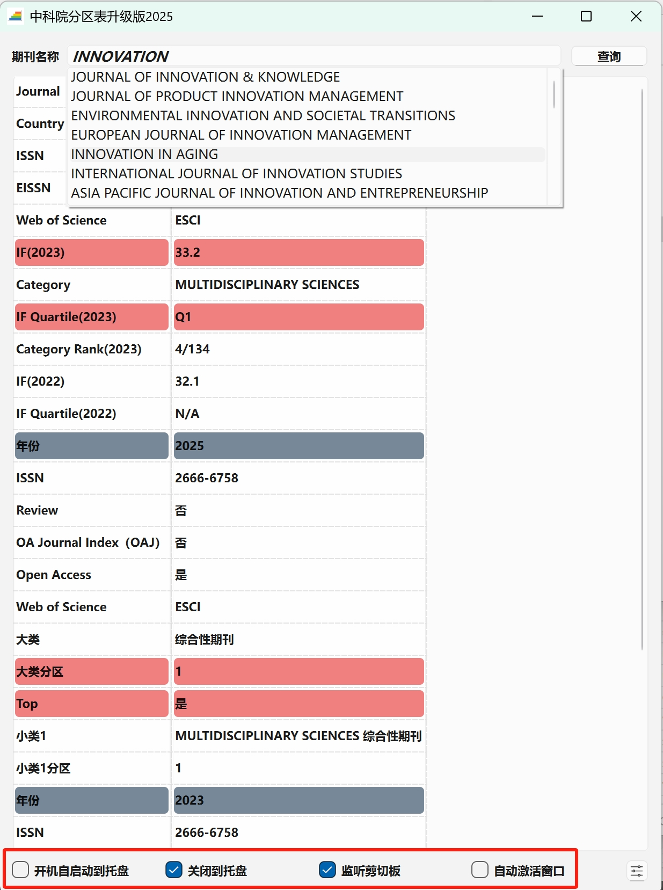

# 如果默认没有显示JCR2025信息，请在程序右下角设置——》选择数据表——》勾选”JCR2025“

# ShowJCR

## 数据来源

新锐期刊分区表来源于[https://www.xr-scholar.com](https://www.xr-scholar.com)，最新为2026年版（2026年3月24日发布），涵盖但不限于 SCIE、SSCI、ESCI 等核心来源，共22299 种期刊和15种重要会议论文集（计算机领域）。同时，不再单独发布预警名单，对预警期刊标记“Under Review”。

中科院分区表升级版数据来源于[advanced.fenqubiao.com](http://advanced.fenqubiao.com)，信息包括期刊是否为Review、是否为Open Access、Web of Science收录类型（分为SCI、SCIE、SSCI、ESCI等）、是否为Top期刊、大类分区信息、（一至多个）小类分区信息。保留最新的2025年版（2025年3月20日发布）作为对比。

JCR期刊影响因子和分区更新到2025版（2026年6月17日发布），并保留2024年影响因子和分区作为对比。

国际期刊预警等级来源于[《国际预警期刊名单》（2020、2021、2023、2024、2025年）](https://ewl.fenqubiao.com/#/README)，2024年版不再区分预警等级而改为预警原因。

中国计算机学会（CCF）[推荐国际学术会议和期刊目录（2026年）](https://www.ccf.org.cn/Academic_Evaluation/By_category/)，[计算领域高质量科技期刊分级目录（2025年）](https://www.ccf.org.cn/ccftjgjxskwml/)。

### 新锐期刊分区表2026年版特殊情况说明

1. ADVANCED ENGINEERING MATERIALS、Soft Science具有两个大类分区，均为材料科学和工程技术；

2. AUSTRALASIAN PLANT PATHOLOGY、HEART RHYTHM具有两本同名期刊，但是两者的ISSN号不一样。

### SQLite3数据库生成步骤

国际期刊信息的原始数据随附在源代码中。

使用[DB Browser for SQLite](https://sqlitebrowser.org/)创建jcr.db，csv格式原始数据的导入顺序（jcr.db中的表名）为JCR2024、JCR2023、GJQKYJMD2025、GJQKYJMD2024、GJQKYJMD2023、GJQKYJMD2021、GJQKYJMD2020、CCF2026、CCFT2025、XR2026、XR2026Conferences、FQBJCR2025。

### 导入新的分区信息

导入新的分区信息，只需要在jcr.db增加相应的数据表，无需修改程序源代码。

分区信息可以处理为csv格式，作为新的数据表使用[DB Browser for SQLite](https://sqlitebrowser.org/)导入到jcr.db（包含在源代码和可执行版本ShowJCR.7z中）。

新的分区信息表的字段格式可以是两种形式：

1. 表第一个数据字段为“Journal”，例如

   | Journal                  | IF(2021) |
   | ------------------------ | -------- |
   | PROCEEDINGS OF THE  IEEE | 14.91    |
   | ······                   | ······   |

2. 表第一个数据字段为其他检索关键字（比如“期刊简称”、“中文刊名”等），第二个数据字段为为“Journal”，例如

   | 刊物简称   | Journal                 | 领域           | CCF推荐类型 |
   | ---------- | ----------------------- | -------------- | ----------- |
   | Proc. IEEE | Proceedings of the IEEE | 交叉/综合/新兴 | A类         |
   | ······     | ······                  | ······         | ······      |

数据表的设计核心是必须包含“Journal”字段，该字段是程序默认的搜索字段；如果“Journal”不是数据表的第一个字段，则该字段之前的字段也将被增加为搜索字段，其字段数据也可以在程序中查询。

## Release发布版

### 运行依赖

1. **jcr.db**，期刊信息数据库；
2. Qt相关依赖（使用windeployqt获取所有依赖项并删除国际化translations文件夹）。

### 可执行版本

提供两种可执行版本：

1. ShowJCR.7z，解压到任意目录下执行ShowJCR.exe；
2. ShowJCR.exe，使用[Enigma Virtual Box ](http://www.enigmaprotector.com/)对所有依赖执行封包，单一程序即可独立执行。

## 使用说明

软件的使用十分方便，如图所示，输入期刊名称，点击“查询”或输入“回车”即可获得期刊详细信息。

在显示的信息中，“年份“字段设置为浅灰色以简易分隔JCR、不同年份的中科院升级版。IF、预警信息、大类分区和”Top“等字段设置为红色以简易标记重要信息。

期刊名称输入时具备联想功能，并且不区分大小写。

如上图中红框所示，软件还具有4个属性选项：

1. 开机自启动到托盘；
2. 退出到托盘；
3. 监听剪切板：在后台监听剪切板，如果复制文字为期刊名称，将自动进行查询；
4. 自动激活窗口：与监听剪切板配合使用，当监听到期刊名称并自动查询完成后，将窗口显示到桌面最前。

设置中支持自定义选择要查询的期刊数据表。
