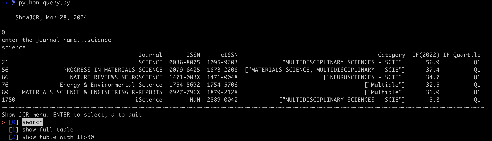

# a simple python script to search keywords and display data
# able to run in Mac OS and linux

how to use
```
pip install -r requirements.txt
python query.py
```

dependancy (see [requirements.txt])
- pandas
- fuzzywuzzy
- simple-term-menu

screenshots



